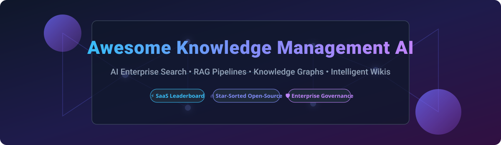

  

# 🧠 Awesome Knowledge Management AI 🚀

  
  
  
  
  
  
  

> 📚 **Curated Hub of Knowledge Management AI Tools, Enterprise Search, Knowledge Graphs, and Open-Source RAG Frameworks**  
> *Track market sizes, SaaS pricing structures, enterprise valuations, and star-sorted open-source repos for modern AI-driven knowledge retrieval.*  
> 🗓️ **Last updated:** September 2026

---

## 📌 Executive Overview

This repository tracks notable SaaS platforms and open-source projects for **Knowledge Management AI**. These platforms enable modern enterprises to capture, structure, and retrieve institutional knowledge using AI-powered enterprise search, Retrieval-Augmented Generation (RAG), Knowledge Graphs, and intelligent agent workflows.

* 💡 **Enterprise SaaS Solutions:** Detailed price breakdown, starting plans, free-tier limits, and corporate valuations.
* 🔓 **Open-Source & Self-Hosted Focus:** High-growth GitHub projects, RAG frameworks, vector databases, and privacy-first local knowledge bases sorted by Stars_Count.

---

## 📖 Table of Contents

- [💼 SaaS/Hosted Platforms](#-saashosted-platforms)
- [⚡ Open-Source GitHub Projects](#-open-source-github-projects)
- [🤝 How to Contribute](#-how-to-contribute)
- [⚠️ Disclaimer](#%EF%B8%8F-disclaimer)
- [📈 Star History](#-star-history)
- [💖 Support & Sponsorship](#-support--sponsorship)

---

## 💼 SaaS/Hosted Platforms

The global AI-driven Knowledge Management market size is estimated at **$7.7B in 2025** and projected to reach **$11.2B in 2026** (with the broader KM software market reaching ~$16.2B–$17.1B). The sector is currently **highly fragmented**, driven by data silos and metadata drift ("fragmentation tax"), but is rapidly undergoing consolidation toward permission-aware semantic infrastructure.

| Product | Enterprise Size / Valuation | Starting Price | Free Tier / Trial Limit | Description |
| :--- | :--- | :--- | :--- | :--- |
| **Confluence + Rovo** | ~$47B Market Cap (Atlassian) | $5.42/user/month | 10 users free limit (Confluence Standard free up to 10 users; Rovo requires paid tier) | Atlassian's AI engine bundled into paid Confluence Cloud plans. Provides AI search across the org's knowledge graph, chat, agents, and "Remix" capabilities. |
| **Notion AI** | ~$11.0B Valuation (~$600M ARR) | $20.00/user/month | 1,000 AI response block limit (bundled in Business Plan) | AI assistant integrated into the Notion workspace, providing writing assistance, Q&A across workspace content, enterprise search, and AI agents. |
| **Glean** | ~$7.2B Valuation (~$300M ARR) | $35.00/user/month | 30-day trial (Requires 100-seat minimum enterprise contract) | AI-powered enterprise search and work assistant indexing 100+ apps with permission-aware retrieval and Enterprise Knowledge Graph. |
| **Stack Overflow for Teams** | $1.8B Valuation (Acquired by Prosus) | $6.50/user/month | 50 users free limit (Free forever plan for up to 50 users) | Private Q&A platform evolving into Stack Internal with AI knowledge ingestion, MCP server integration, and human-verified workflows. |
| **Document360 AI (Eddy AI)** | ~$10M+ ARR (Kovai.co) | $149.00/month | 14-day free trial limit | Knowledge base platform with AI-assisted article generation, SEO metadata, intelligent search, and Eddy AI chatbot. |
| **Bloomfire** | ~$11.7M ARR | $25.00/user/month | 14-day free trial limit (Typically 50-user minimum starting commitment) | Knowledge engagement platform with AI-powered search, community Q&A, content verification, and enterprise onboarding. |
| **Helpjuice** | ~$4.5M ARR | $249.00/month (flat rate up to 30 users) | 14-day free trial limit | Knowledge base software with AI-powered search, rich text editor, version control, and multi-language support. |
| **Tettra** | ~$3.2M ARR | $8.00/user/month | 30-day free trial limit (10-user minimum on paid plans) | Lightweight internal knowledge base with AI capabilities. Integrates with Slack and Teams to capture tribal knowledge into documentation. |
| **Guru** | ~$2.5M ARR (Private) | $25.00/user/month | 30-day free trial limit (10-seat minimum commitment) | AI-powered knowledge management surfacing verified answers directly in Slack, browser, and enterprise workflows. |
| **Slab** | ~$2.0M ARR (Private) | $6.67/user/month | 10 users free limit (Free plan up to 10 users & guests) | Modern knowledge base with AI-powered unified search across connected tools, focusing on streamlined internal documentation. |
| **Nuclino** | <$1.0M ARR (Private) | $5.00/user/month | 50 items & 2GB storage free limit (Free plan with 50 items total) | Collaborative wiki with AI features, combining docs, real-time editing, and visual graph view for connected knowledge. |

---

## ⚡ Open-Source GitHub Projects

Below is a curated selection of open-source knowledge management platforms, RAG orchestration frameworks, vector databases, knowledge graphs, and documentation tools, sorted by GitHub Stars_Count.

| Project | GitHub_Stars | License | Description |
| :--- | :--- | :--- | :--- |
| **[LangChain](https://github.com/langchain-ai/langchain)** |  | MIT | Standard framework for building LLM applications, custom RAG pipelines, and agentic workflows. |
| **[Dify](https://github.com/dify-ai/dify)** |  | AGPL-3.0 | Open-source LLM application development platform with visual RAG pipeline builder and knowledge base orchestration. |
| **[AppFlowy](https://github.com/AppFlowy-IO/AppFlowy)** |  | AGPL-3.0 | Open-source Notion alternative built with Flutter and Rust, featuring native AI workspace capabilities. |
| **[RAGFlow](https://github.com/infiniflow/ragflow)** |  | Apache-2.0 | Open-source RAG engine based on deep document understanding, delivering structured knowledge extraction and citations. |
| **[AnythingLLM](https://github.com/Mintplex-Labs/anything-llm)** |  | MIT | All-in-one desktop & enterprise AI application for turning documents into searchable knowledge bases with full privacy. |
| **[Meilisearch](https://github.com/meilisearch/meilisearch)** |  | MIT | Lightning-fast, hyper-relevant hybrid & vector search engine designed for intuitive documentation search. |
| **[LlamaIndex](https://github.com/run-llama/llama_index)** |  | MIT | Data framework for connecting custom enterprise data sources to LLMs for context-augmented applications. |
| **[Milvus](https://github.com/milvus-io/milvus)** |  | Apache-2.0 | Cloud-native vector database designed for scale and enterprise RAG search operations. |
| **[Outline](https://github.com/outline/outline)** |  | BSL-1.1 | Fastest collaborative team knowledge base built on Node.js and React with rich AI search capabilities. |
| **[Quivr](https://github.com/QuivrHQ/quivr)** |  | Apache-2.0 | Open-source Second Brain powered by Generative AI to store and query unstructured knowledge documents. |
| **[Langchain-Chatchat](https://github.com/chatchat-space/Langchain-Chatchat)** |  | MIT | Offline-first local knowledge base QA application built with LangChain and self-hosted LLMs. |
| **[Qdrant](https://github.com/qdrant/qdrant)** |  | Apache-2.0 | High-performance vector similarity search engine and database with extended payload filtering. |
| **[Typesense](https://github.com/typesense/typesense)** |  | GPL-3.0 | Fast, typo-tolerant open-source search engine supporting hybrid vector and keyword search. |
| **[Haystack](https://github.com/deepset-ai/haystack)** |  | Apache-2.0 | Production-ready AI framework for building NLP pipelines, semantic search, and agentic RAG. |
| **[pgvector](https://github.com/pgvector/pgvector)** |  | PostgreSQL | Open-source vector similarity search extension for PostgreSQL database instances. |
| **[Docmost](https://github.com/docmost/docmost)** |  | AGPL-3.0 | Open-source collaborative documentation and wiki software, serving as a Notion/Confluence alternative. |
| **[Neo4j](https://github.com/neo4j/neo4j)** |  | GPL-3.0 | Native graph database platform optimized for enterprise Knowledge Graph relationship mapping. |
| **[Weaviate](https://github.com/weaviate/weaviate)** |  | BSD-3-Clause | Open-source AI-native vector database for hybrid search and multi-modal knowledge storage. |
| **[ArangoDB](https://github.com/arangodb/arangodb)** |  | Apache-2.0 | Multi-model database combining graph, document, and search engine capabilities for knowledge layers. |
| **[OpenSearch](https://github.com/opensearch-project/OpenSearch)** |  | Apache-2.0 | Community-driven, open-source search and analytics suite supporting enterprise hybrid search. |
| **[PipesHub](https://github.com/pipeshub-ai/pipeshub-ai)** |  | MIT | AI context layer unifying business data with 87+ connectors, RAG pipeline, and MCP server. |
| **[Petrichor](https://github.com/kushalpandya/Petrichor)** |  | MIT | Self-hosted knowledge platform turning Markdown into wikis, evidence, and agent-ready knowledge. |
| **[Xyne](https://github.com/xynehq/xyne)** |  | AGPL-3.0 | AI-first search and answer engine for work, providing Glean alternative with cross-app indexing. |
| **[OpenBeam](https://github.com/tensorkithq/openbeam)** |  | AGPL-3.0 | Open-source Glean alternative bridging SaaS tools and physical operations data (IoT/Industrial protocols). |
| **[Kherad](https://github.com/mohammadmaso/kherad)** |  | AGPL-3.0 | Self-hosted, git-backed knowledge base with block editor, real git commits, and RAG chat over docs. |

---

## 🤝 How to Contribute

1. 🍴 **Fork the repository**
2. 📝 **Add or update entries** in `README.md` (ensuring exact tabular format and accurate figures)
3. 🔗 **Include essential metadata:** Name, official/repository link, description, pricing/licensing
4. 🚀 **Submit a Pull Request** with a concise description of your changes
5. ⭐ **Star the repo** if this resource helps your research or enterprise build!

Also check out our meta-list: [Awesome-Awesome-Awesome](https://github.com/ishandutta2007/Awesome-Awesome-Awesome) for more curated lists!

---

## ⚠️ Disclaimer

- This is a community-curated list — not an exhaustive list or direct endorsement.
- Knowledge management AI tools index sensitive enterprise documents; enforce proper access controls, permission-aware indexing, and AI governance policies.
- Self-hosted open-source solutions require proper security hardening, model governance, and regular data compliance audits.

---

## 📈 Star History

---

## 💖 Support & Sponsorship

Thank you for exploring and contributing to **Awesome-Knowledge-Management-AI**! 🙏

If you find this repository valuable for your work, research, or enterprise AI setup, please consider:
- ⭐ **Starring** the repository on GitHub
- 🔀 **Forking** and sharing with colleagues and fellow engineers
- 💬 **Joining our community** on [Discord](https://discord.gg/jc4xtF58Ve)
- ☕ **Sponsoring the project / Buying a coffee:** 

*Made with ❤️ for knowledge managers, platform engineers, AI practitioners, and enterprise architects.*
